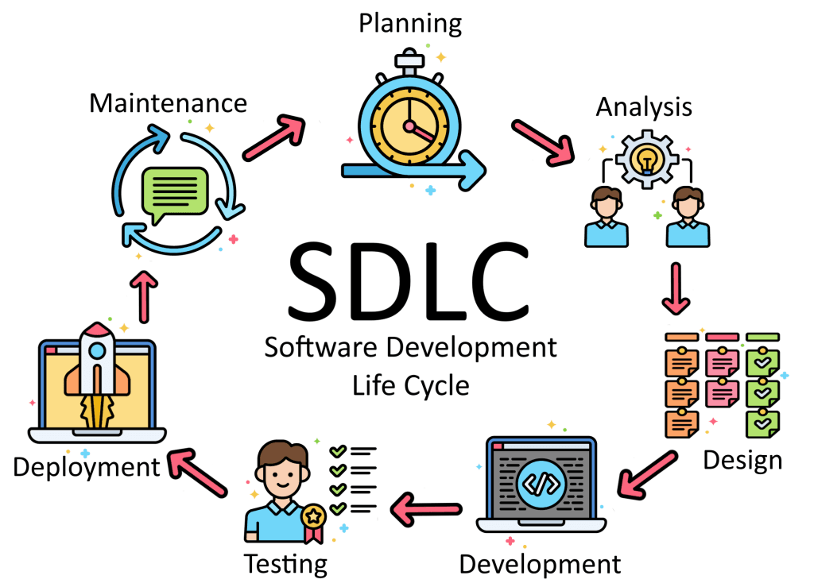

Business & Technology:

1. Business has more priority than technology 
2. Adding technology to business will reduce cost, stability, relaibility, increase business income

Software Development Life cycle (SDLC):
=======================================
Business Analyst : he will gather all info regarding business and give to architects and architects will read docs and address all business problems with technology

Requirements gathering
Analyse (all requirements)
Design the system (HLD, LLD)
Development (coding)
Testing
Deployment (Deploy to prod)
Maintainance and Monitoring

Waterfall vs Agile vs Agile with Devops:
=========================================

Stakeholders -> Who are part of the system(project)

Project -> RBI, Government, Banking management, investors, bod, developers, testing, admin, devops and cloud, Support, reports, monitoring, etc.

if you test a system 1 time, you get 10 defects
if you test a system 100 times, you get aleast 11 defects

Pilot tests: we do this to check the success rate when we are going from one process to other

Environments need to cross before going to actual prod:
DEV, QA, SIT, UAT, PERF, PRE-PROD, PROD (same product will be tested by multiple teams)

Ex: A cool drink formula

formula -> test the drink -> DEV
employees -> taste the drink, take feedback -> QA
friends and family members -> take feedback -> SIT
random group -> take feedback -> UAT
Fassai -> take certification -> Client approval
release to public market -> PROD

In the above example where devops role will come?? 
Devops engineers will make the infrastructure ready for all the environments including production to make the app(product) move from one environment to other and how the app moves is the waterfall/agile/agile with devops model

Waterfall model:
-----------------
usually followed in late 2000's

Ex: Lets say 3 years to complete project 
Due to initial prerequisite and planning some time will get wasted - here from dev all teams will be free
Then development starts (dev will work)  - at this point testers, operations, build and release teams (before devops) will be free
After complete product is ready testers will start working and raise bugs, then again dev comes back and fix the bugs and share build.

With the above practice, amount of testing cycles will be less and the most common issue with this approach is build will work in dev environment but fails to work in test/prod environments.

So this practice failed in delivering the actual requirements what client needs and to address this issue agile came in.

Agile Model:
-------------
Followed in early 2010's to 2015's

Ex: Lets say timeline to deliver project/product is 3 years
Entire project is divided into modules (each module 1 month time)
Every month need to deliver a working product

sprint-1: 
1 month(15 days dev + 15 days testing & deployment)
developers ---> work starts from day-1
testing --> lets say work start from day-10 initial days were spent on understanding the documents
end of month ---> some working product will be delivered to client
if any bugs present and needs to be fixed will go to backlog for next sprint.

sprint-2: (contains backlog work of sprint-1 if present)

Here DSU's(daily standup call) will happen delivery manager/certified scrum master will ask for status updates - what did you do yesterday, what are you doing today and any blockers

This is the era of digital revolution and now waterfall wont work.

Even with agile some defects are missing from being fixed which affects the business then daily tests(daily build validation) came in

Daily tests: some working code will be developed everyday and share the build, testers will write positive and negative cases and test the daily shared build with this approach there will be less chances of invalid defects as number of test cycles increased, productivity increases

Daily development + Daily testing nothing but DEVOPS

Error types:
Build errors, Deployment errors, Functionality errors, configurational errors (In every environment application/product should be built, functionality should be tested and deloyed)

Now-a-days all legacy apps(which uses old technology) moving from waterfall to agile to reduce cost as these apps require more mainatainance which increases cost
Ex: banking sector --> IDBI bank runs legacy app currently has low revenue --> they invest some money in tech and goes to agile model to reduce cost

What is DEVOPS:
================
Devops is a process of building, testing, deploying the product continously. Basically if we can deploy and test the code in the same day we can get maximum feedback cycles thats improves the quality of product.
Ofcourse we use multiple tools to make the process of continous deployment, integration, deployment, delivery, testing, monitoring, security etc smooth everything is part of devops.

Roles and Responsibilities:
---------------------------
In every environment we need to manage infrastructure similar to prod
code+infra needs to be managed efficiently
code --commit--> build --> test ---> deploy
for every code commit above process should run

coming to infra, on prem and cloud concepts are same 
in on prem managing resources will be more
